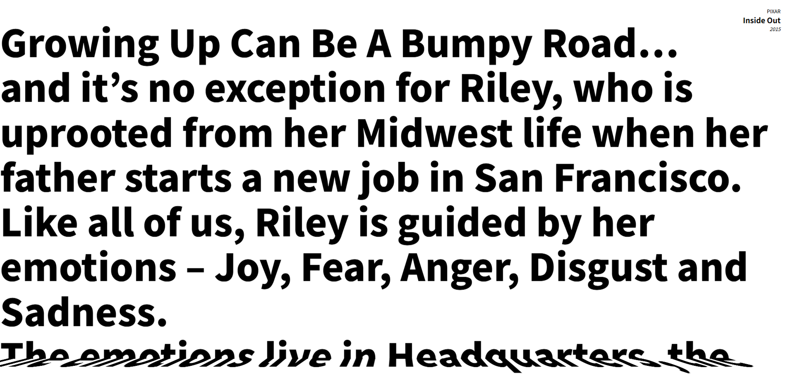
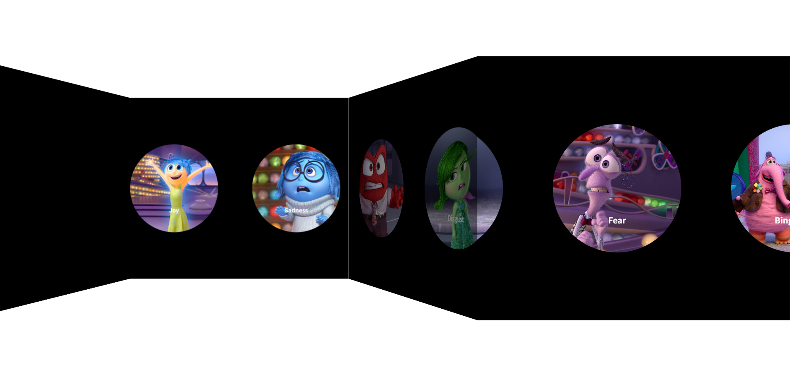

# 🗺️ 3D Folding Effect
> Interactive 3D folding effect with smooth scrolling and draggable image gallery

  
  

[🔗 Live Demo](https://3d-folding-effect.netlify.app/)

---

## Features

- **3D Text Folding Effect**: Vertical scroll-based 3D text animation with smooth interpolation
- **Draggable Image Gallery**: Horizontal drag-to-scroll image viewer with 3D folding layers
- **Smooth Scrolling**: Lenis integration for buttery smooth scroll experience (desktop only)
- **Linear Interpolation**: Custom lerp animation for natural, smooth motion

## Tech Stack

- **Lenis** (smooth scrolling library)
- **JavaScript (ES6+)**

- **SCSS** (CSS preprocessor with 3D transforms)
